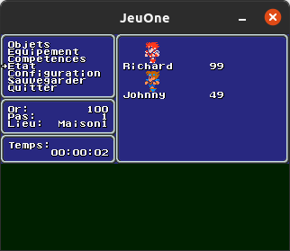

# RPG #

Moteur de jeu léger pour un J-RPG 2D avec un minimum de dépendances.

## Contenu ##

Le dépôt contient les sources de:
* Une bibliothèque de classes `JeuLib` (sans dépendance externe) pour organiser les variables nécessaires au jeu,
* Plusieurs bibliothèques de moteurs graphiques `JeuGfx` et entrées/sorties `JeuES` pour le jeu, à utiliser selon la plateforme,
* Un exécutable `JeuOne` pour lancer le jeu, structuré autour du `main` qui lance différentes "scènes" manipulant les classes de `JeuLib`,
* Un exécutable `txt2dat` pour convertir les ressources `*.txt` en un format plus compact `*.dat`,
* Un éditeur de ressources (expérimental) implémenté avec Qt et reposant sur `JeuLib`.

## Installation et exécution ##

* Les sources sont accompagnées d'un cmake, les bibliothèques externes dépendent des moteurs choisis,
* L'exécutable doit être lancé à la racine du dépôt, où qu'il soit compilé (par exemple `.\build\JeuOne.exe` sous Windows).

## Plateformes supportées ##

* Linux, avec `SDL2` ou `cstdio` comme moteur graphique : `./bin/JeuOne`
* Windows 32/64bits (XP, Vista, 7 et 10), avec `SDL` (1.2, expérimental), `SDL2` ou `cstdio` comme moteur graphique : `.\build\JeuOne.exe`
* Sony PlayStation 1, avec son moteur graphique dédié : `/iso/image.cue`, `/iso/image.bin`
* Windows 98 (expérimental), avec `SDL` (1.2) comme moteur graphique.

## Aperçu ##

Pour illustrer les fonctionnalités du moteur graphique et de `JeuOne`, Les ressources graphiques proviennent de différents jeux [pré-existants](https://www.spriters-resource.com/nes/finalfantasy3jpn/).

 

 

 
