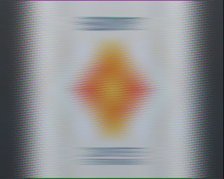
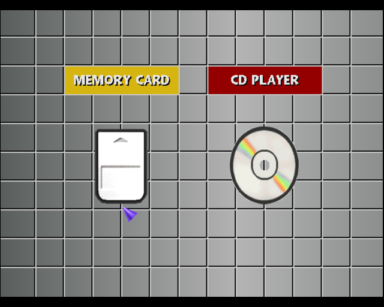
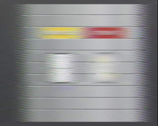

## Video capture with the soundcard

Adapted from [jack_capture](https://github.com/kmatheussen/jack_capture) V0.9.73 (Released 2017-05-19, Kjetil S. Matheussen) distributed under GNU Public License (version 2 or later)

`jack_capture_video` uses the soundcard and associated microphone jack to display (in real time) and/or record an analog video signal.

It uses the original `jack_capture` sound capture functions with `jackd` but adapts them to store the information in an `OpenCV` 2D array with minimum processing.

The main challenges are:
* detect the horizontal and vertical synchronization signals from the video source
* store and duplicate/drop pixels in the 2D array as efficiently as possible.

The final results are much lower quality than the original signal due to the soundcard's limited bandwidth. Most of the original horizontal resolution is lost, requiring the pixel duplication process mentionned above.

## Results

Here are examples for a PAL signal recorded at 192KHz from the composite output of a PlayStation, the horizontal resolution drops from 320 (or 640 in interlaced mode) to about 12 pixels:

From emulation                |  From `jack_capture_video`
:----------------------------:|:-------------------------
 | 

In composite mode, the temporal resolution is too low to capture the color (only the luminance is "decoded"). Here is a couple of recordings of an RGB signal in 3 passes to produce a full color frame (channels are manually merged):

From emulation                |  From `jack_capture_video`
:----------------------------:|:-------------------------
 | 
 | 

Emulation images sources:
* https://www.youtube.com/watch?v=R9VEODW88l0
* https://pixel-maniac.com/retrogaming/forum/topic/duckstation-emulateur-psone/
* https://drew1440.com/psx/

## Usage

Tested on Ubuntu 18.04 and 20.04.

Parameters may require adjusting depending on available hardware, which can be checked with:
```
./launch_info.sh
```

Then the `jackd` client must be launched with the correct parameters:
```
./launch_jack.sh
```

Finally the compilation and capture can be started (constants may require adjustments in `jack_capture_video.cpp` as well):
```
./launch_capture.sh
```
